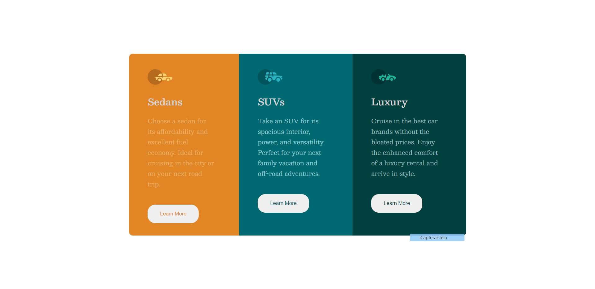

# Frontend Mentor - 3-column preview card component solution

This is a solution to the [3-column preview card component challenge on Frontend Mentor](https://www.frontendmentor.io/challenges/3column-preview-card-component-pH92eAR2-). Frontend Mentor challenges help you improve your coding skills by building realistic projects.

## Table of contents

- [Overview](#overview)
  - [The challenge](#the-challenge)
  - [Screenshot](#screenshot)
  - [Links](#links)
- [My process](#my-process)
  - [Built with](#built-with)
  - [What I learned](#what-i-learned)
  - [Continued development](#continued-development)
  - [Useful resources](#useful-resources)
- [Author](#author)

## Overview

### The challenge

Users should be able to:

- View the optimal layout depending on their device's screen size
- See hover states for interactive elements

### Screenshot

### Links

- Solution URL: [Frontend Mentor](https://www.frontendmentor.io/solutions/3column-preview-card-component-using-css-flexbox-fmI_wWBvP)
- Live Site URL: (https://htmlpreview.github.io/?https://github.com/lucasilvafon/3columnPreviewCard/blob/main/index.html)

## My process

### Built with

- Semantic HTML5 markup
- CSS custom properties
- Flexbox
- Mobile-first workflow

### What I learned

During this challenge, I put into practice some of the knowledges I've been studying, like semantic HTML5 markup, style props, but mostly CSS Flexbox, which I used for the whole positioning on this landpage.

To see how you can add code snippets, see below:

### Continued development

I am really looking forward studying about CSS Grids for most CSS comprehension. And, also dive into JS.

### Useful resources

- [FLEXBOX FROGGY](https://flexboxfroggy.com/)
- [CSS TRICKS - COMPLETE GUIDE TO FLEXBOX](https://css-tricks.com/snippets/css/a-guide-to-flexbox/)

This both websites helped me a lot through the whole process.

## Author

- Github - [lucasilvafon](https://github.com/lucasilvafon)
- Frontend Mentor - [@lucasilvafon](https://www.frontendmentor.io/profile/lucasilvafon)

